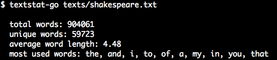

# textstat-go

Textstat is an utility to get statistics about text content.

The main reason behind this is me wanting to hack on a nice little project. Textstat happens to be well suited to explore new technologies.



I am glad about any suggestions since I'm only learning here.
Feel free to use the [Issues][issues] / [Pull Request][pr].

(There's also a [Ruby version][rb] of this project.)

## Setup

- [Download the binary][bin] and you are good to go.
- Optional you can add it to your `$PATH`.


## Usage

Textstat can be used as a command-line tool or imported as Go package.

### Command-line

You can pass a path to a file:

    textstat-go texts/shakespeare.txt

Or stream content to Textstat:

    echo 'some content' | textstat-go
    textstat-go < texts/shakespeare.txt
    cat texts/shakespeare.txt | textstat-go

To analyze a whole folder you could run:

    find . -type f -print0 | xargs -0 cat | textstat-go


### Go API

Import the package:

```go
import (
  textstat "github.com/jorin-vogel/textstat-go/lib"
)
```

For now see [textstat.go][lib] details on the API.


## Development

### Requirements

- Make sure you have [Go][go] installed.

### Setup

- Download the repo:
`go get github.com/jorin-vogel/textstat-go`

### Workflow

- Test the code with `go test` or `go test -cover`.
- Update the binary using `go install`.


## License

MIT


[rb]: https://github.com/jorin-vogel/textstat-rb
[issues]: https://github.com/jorin-vogel/textstat-go/issues
[pr]: https://github.com/jorin-vogel/textstat-go/pulls
[bin]: https://github.com/jorin-vogel/textstat-go/releases
[lib]: lib/textstat.go
[go]: https://golang.org/
